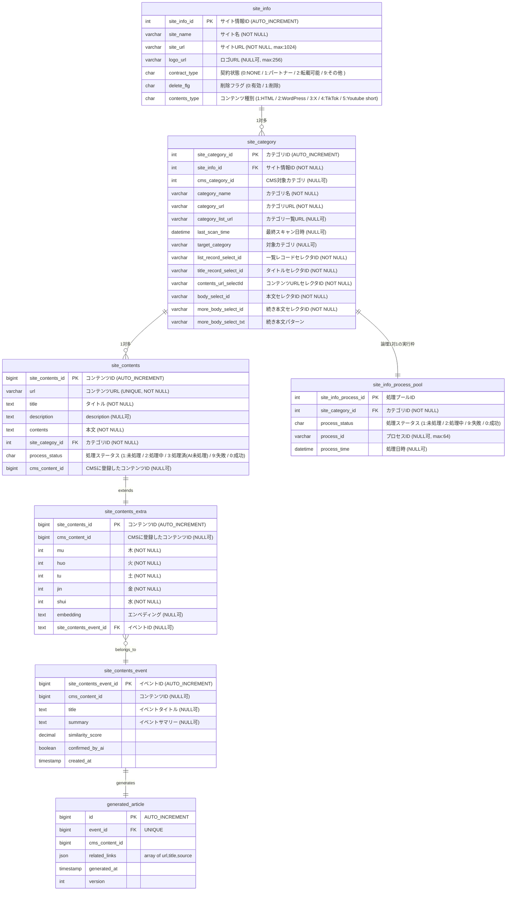

# 主要コンポーネント
- **ContentsParser**: `SiteCategory`からのCSSセレクタ（例：`listRecordSelectId`、`titleRecordSelectId`）を使用してHTMLを解析。
- **BatchConfig**: 対象カテゴリを固定partitionへ分割し、worker assignment単位のリーダー/プロセッサ/ライターで`crawlJob`を定義。
- **SiteContentsService**: プロセスステータスの変更を管理し、run-wideの`postContentsLimitCount`でWordPress投稿attemptを制限。
- **Entities**: Lombok `@Data`を使用、カスタムenumコンバータで文字列ベースのDBストレージ。

# 処理フロー
## クロール処理
1. DBから、登録されるSiteInfo(条件：deleteFlg=0)、SiteCategory(条件：deleteFlg=0)を取得して、各サイト情報とサイトに属するカテゴリ設定情報をもとに、設定を初期化する。
2. run開始時に全対象カテゴリを昇順で固定し、`CRAWL_PROCESS_LIMIT`以下のworkerへ重複なく分割する。各workerは担当カテゴリを順次処理し、カテゴリごとのclaim/releaseはSiteInfoProcessPoolで管理する。
3. contents_typeが1(HTML)の場合、<br>
  3.1. サイトカテゴリ画面(category_list_url)のページ内容から、list_record_select_idをもとにコンテンツの一覧を取得する<br>
  3.2. 取得したコンテンツのタイトル(セレクタ情報：title_record_select_id)、URL(セレクタ情報：contents_url_selectId)をもとに、本文(セレクタ情報：body_select_id)を取得する。但し、本文にもっと見るような表現がある場合、もっと見るから、本文(セレクタ情報：more_body_select_id)を取得する。
4. contents_typeが2(WordPress)の場合、<br>
  4.1. wordpressのRestAPIの仕様をもとにデータを解析して、取得する。category_urlから、該当するカテゴリからデータをクロールする。
5. contents_typeが3(X)の場合、<br>
  5.1. XのAPI の仕様をもとにデータを解析して、取得する。category_urlから、対象アカウントを特定してカテゴリとして、データをクロールする。
6. contents_typeが4(TikTok)の場合、<br>
  6.1. TikTokのAPI の仕様をもとにデータを解析して、取得する。category_urlから、対象チャンネルを特定してカテゴリとして、データをクロールする。
7. contents_typeが5(Youtube short)の場合、<br>
   7.1. YoutubeのAPI の仕様をもとにデータを解析して、取得する。category_urlから、対象チャンネルを特定してカテゴリとして、データをクロールする。
8. 取得したコンテンツ情報を未処理として、SiteContentsに登録する
9. 処理の途中で、エラーが発生する場合、該当するコンテンツレコードの処理をロールバックして、warnログを出力して、スキップして、次へ進みます。

## Wordpressへの通常コンテンツ登録処理
API仕様は `docs/03_api.md` に従う。WordPress公式REST APIの `POST /wp/v2/posts` を利用し、認証はApplication PasswordによるBasic認証とする。

1. DBから、行ロックで、SiteContentsの処理ステータスが「1:未処理」のコンテンツを取得して、処理ステータスを「2:処理中」に更新する
2. 更新した処理中のレコード情報をもとに、WordpressのAPIで、「Wordpressへの通常コンテンツ登録処理の詳細」をもとに、対象カテゴリに投稿します。対象カテゴリはSiteCategoryのCMS対象カテゴリ設定から取得する情報である。
3. 処理成功した場合、処理ステータスを「3:処理済(AI未処理)」に更新してコミットする。
4. 処理にエラーが発生した場合、処理ステータスを「9:失敗」に更新してコミットし、回収可能な失敗では後続へ進む。投稿APIのリトライは行わず、失敗件数があれば最終Jobは`FAILED`とする。
### Wordpressへの通常コンテンツ登録処理の詳細
1. 対象カテゴリはSiteCategoryから取得する情報である。
2. コンテンツ詳細から、タイトル、descrpitionを取得しなおして、設定する。<br>コンテンツの所属するサイトに、契約状態(contract_type)がNONEの場合、投稿の本文にdescriptionで登録し、descriptionがnullの場合、タイトルを本文にすること。<br>契約状態(contract_type)が1以上の場合、site_contentsのcontentsで本文に投稿する。
3. 記事に画像が含まれる場合、画像をサイトの画像として投稿して、１枚目の画像を記事のキャプチャ画像として設定し、記事内の画像リンクを投稿した当てはまるサイト内の画像のリンクを置換する。<br>なお、一枚目の画像がYahooニュースのロゴ画像の場合、キャプチャ画像のとして除いて、次の画像を使用して、次の画像もない場合、キャプチャ画像を指定しない。(Yahooニュースのロゴ画像のファイル名パターン：news_*.png)
4. WordPress投稿カテゴリは、site_contentsの`cms_category_id`もとに、当てはまる`cms_target_category`の値でCMSのカテゴリを設定する。複数カテゴリある場合、`cms_target_category`の値をもとに、カテゴリ設定を追加する。
5. 本文解析にbody_select_idを使って取得する。正し、本文は次のページに隠すことがあるので、 「記事全文を読む」(CSV形式のmore_body_select_txtに含まれる文字列)リンクが現れる場合、リンクへ遷移して、more_body_select_idで本文を取得する。
6. 既に登録済みのコンテンツについて、該当するカテゴリ情報がない場合、カテゴリ情報だけをコンテンツに追加する。

## 既存WordPress投稿のfeatured image repair

`REPAIR_CMS_CONTENT_ID` を指定した実行は通常クロール・新規投稿と排他的なrepair-onlyモードとする。対象CMS IDを持つ既存 `SiteContents` 1件だけを処理し、新しいWordPress postは作成しない。

1. process poolは1 leaseだけclaimする。カテゴリ一覧取得、通常の記事保存、CMS未投稿候補の処理は行わない。
2. 対象の `featured_image_url` が空なら、保存済み元記事URLを `ContentsParser` で再取得し、通常の `ArticleImagePolicy` で画像URLを再選定する。取得したURLだけを既存 `SiteContents` に保存し、`cms_content_id` と `process_status` は維持する。
3. WordPressの既存postを取得し、`featured_media=0` かつ有効な元画像URLがある場合、公式media APIへ登録する。
4. media登録時に既存post IDをparentとして指定する。前回がmedia成功・post更新失敗だった場合は、同じparentのmediaを取得して画像bytesが一致するものを再利用し、重複uploadを防止する。
5. `POST /wp-json/wp/v2/posts/{cms_content_id}` には `featured_media` だけを送り、title、content、categories、URL、post IDを変更しない。
6. source再取得、画像選定、media登録、post更新のいずれかが失敗した場合はpoolをFAILで解放する。成功時はSUCCESSで解放する。

このrepairはCrawler Job内部の限定経路であり、独立Job・独立サービス・独立CMSサブシステムではない。通常フローを置き換えず、`REPAIR_CMS_CONTENT_ID` 未指定時の挙動は変更しない。


## Wordpressへのまとめ登録処理(AI)
### 前提
- `application.yaml` で指定された期間（デフォルト14日）内のデータのみを処理対象とする。
- AIプロバイダ（DeepSeek API 等）はインターフェースで抽象化し、容易に切り替え可能とする。
- Embedding の計算・比較はアプリケーション層（Java）で実行し、データベースには結果のみ永続化する。

### 処理の流れ

#### ステップ1：対象コンテンツの抽出
1. `site_contents` テーブルから以下の条件でレコードを取得する。  
   - `process_status = '3'` （AI未処理）  
   - クロール日時（または `created_at`）が現在日時から `n` 日以内  
   - 取得時に行ロックをかけ、`process_status` を `'2'`（処理中）に更新する。
2. 抽出した各コンテンツに対し、まだ `site_contents_extra` レコードが存在しない場合は新規作成する。

#### ステップ2：AIによる解析（DeepSeek API 等） – 五行評価とEmbedding生成
1. **五行評価**:  
   各コンテンツの `title` と `contents` をAIに送信し、木・火・土・金・水の各属性スコア（0～100）を取得する。  
   → 結果を `site_contents_extra.mu / huo / tu / jin / shui` に更新する。
2. **Embedding生成**:  
   同じくAIのEmbedding APIを用いて、`title + contents`（または `contents` のみ）のベクトル（1536次元）を取得する。  
   → `site_contents_extra.embedding` にJSON配列文字列として保存する。  
   （例：`"[0.12, -0.34, ...]"`）

#### ステップ3：アプリケーション層での類似度計算とイベントグループ化
1. メモリ上に、ステップ1で処理対象となった全コンテンツのEmbeddingを読み込む（または今回処理分のみを保持するキャッシュを構築）。
2. 各コンテンツを順次、**同一バッチ内の他コンテンツ** および **既存の直近イベントの代表ベクトル**（後述）と比較する。
   - 類似度計算：コサイン類似度を使用。
3. **同一イベント判定**:
   - 類似度が閾値（例：0.92）以上のペアが見つかり、かつそれが初回の組み合わせであれば、仮のグループを形成する。
   - すでに何らかの `site_contents_event` に属しているコンテンツと類似する場合は、同じ `event_id` を割り当てる。
4. **イベントレコード作成/更新**:
   - グループ内のコンテンツ数が2件以上の場合、以下の処理を行う。
     - 新しいグループであれば、`site_contents_event` に新規レコードを作成（`title`, `summary` はまだ空で可）。
     - 各コンテンツの `site_contents_extra.event_id` に該当 `event_id` を設定する。
   - 既存イベントに追加された場合は、その `event_id` を設定する。

#### ステップ4：イベントのタイトル・サマリー生成と記事統合
1. ステップ3で新規作成された、またはコンテンツが追加されたイベントのうち、**まだ `generated_article` が存在しない**、または**コンテンツが追加されたことで更新が必要なもの**を対象とする。
2. イベントに属する全コンテンツの `title`, `url`, `contents`（または契約状態に応じた本文）を収集し、AI（Chat API）に以下のプロンプトで送信する。
   ```
   あなたはニュース編集者です。以下のURLと記事はすべて同じ出来事について報じています。
   これらを統合し、日本語で一つの客観的な記事を作成してください。
   タイトルと本文（要約）を生成し、最後に参照元URLリストをJSON形式で出力してください。
   ```
3. AIからの応答を解析し、以下の情報を取得する。
   - 統合記事タイトル → `site_contents_event.title` に保存。
   - 統合記事本文（サマリー） → `site_contents_event.summary` に保存。
4. 同時に、参照元URL一覧（関連リンク）をJSON形式で生成させる。これは `generated_article.related_links` に保存する。
   ```json
   [
     {"url": "...", "title": "...", "source": "..."},
     ...
   ]
   ```

#### ステップ5：WordPressへの投稿（生成記事）
1. ステップ4で作成/更新された `generated_article` レコード（`generated_article` テーブル）を元に、WordPress APIで記事を投稿する。
   - タイトル：`site_contents_event.title`
   - 本文：`site_contents_event.summary` + 整形した関連リンク一覧<br>本文の内容はテンプレートから管理します。<br>本文テンプレート:src/main/resources/templates/contents_body.ftl<br>使用する変数：body(本文)、orgUrl(引用元URL)、orgSite(引用元サイト)、orgSiteLogo(引用元サイトのロゴ)
   - カテゴリー：`site_category.target_category` を利用（イベントに属するコンテンツのカテゴリーから決定）
2. 投稿成功後、WordPressの記事IDを `generated_article.cms_content_id` に保存し、`generated_at` を更新する。
3. **既存イベントに新たなコンテンツが追加された場合**:
   - `generated_article` を更新するか、新規バージョンとして作成する（`version` をインクリメント）。
   - WordPress側の記事を更新（または再投稿）し、関連リンクを追記する。

#### ステップ6：後処理
1. 処理が完了した `site_contents` の `process_status` を `'0'`（成功）に更新する。
2. イベントに属さなかった（単独で類似コンテンツがなかった）コンテンツは `process_status` を `'3'` のままに戻すか、あるいは別途「単独記事」として扱う（要件次第）。
3. エラー発生時は当該コンテンツの `process_status` を `'9'`（失敗）にし、ログを出力して次へ進む。

### 補足
- **性能**: 数百件規模のEmbedding比較はJava内で数秒で完了するため、専用ベクトルDB不要。
- **既存イベントの代表ベクトル**: 各イベントの全コンテンツの平均ベクトルをキャッシュしておくと、新着コンテンツの所属判定が効率的になる。
- **閾値調整**: 0.92 は初期値として設定し、必要に応じて `application.yaml` で変更可能にする。

# データモデルの説明
## ER図

# WordPressカテゴリ設定仕様（2026-06-29更新）

WordPress投稿カテゴリは、`site_category.cms_category_id` を主カテゴリとして `categories` の先頭に設定する。
`site_category.cms_target_category` にCSV形式の追加カテゴリがある場合は、主カテゴリの後ろへ重複を除いて追加する。
`cms_target_category` が空または空白のみの場合だけ、互換用の `site_category.target_category` を追加カテゴリとして利用する。
カテゴリ値はWordPress REST APIの `categories` に指定できる数値IDのみ有効とし、不正な値はスキップする。

## WordPress画像・アイキャッチ画像設定仕様（2026-08-13更新）

WordPressへの通常コンテンツ登録では、テンプレート適用後のHTML全体ではなく、記事本文部分の画像のみをWordPressメディア登録対象とする。
`ArticleImagePolicy` は、元記事からアイキャッチ候補となる画像URLを選択するCrawler内部ロジックであり、WordPress APIやmedia IDを扱わない。`site_contents.featured_image_url` には選択した元記事の画像URLを保存し、WordPress側media IDは保存しない。
画像登録は同じCrawler実行フロー内の `WordPressPostService` がWordPress公式REST API `POST /wp-json/wp/v2/media` で行い、レスポンスのmedia IDを `POST /wp-json/wp/v2/posts` の `featured_media` に指定する。独自の画像登録API、media管理テーブル、独立Job、独立サービスは追加しない。`WordPressPostService` はCrawler内部のJavaクラスとしての責務分離であり、独立サブシステム化を意味しない。
現行フローは `クロール -> SiteContents保存 -> 必要ならAI加工 -> WordPress media API登録 -> WordPress posts API投稿 -> cms_content_id / status更新` を維持する。AI加工時も `featured_image_url` は投稿用copyへ引き継ぐ。
引用元サイトロゴ、Yahooニュースなどの媒体ロゴ、テンプレート上の出典ロゴ、広告画像、トラッキング画像、1px画像はWordPressメディアとして登録せず、`featured_media` にも設定しない。
テンプレート上の出典ロゴは投稿本文にも画像として出力しない。公開テーマや一覧表示が本文先頭画像をサムネイル扱いする場合でも、ロゴがアイキャッチ風に表示されないようにする。
既存CMS投稿についてはカテゴリ同期時に公開済み投稿の本文・アイキャッチを確認し、ロゴ・トラッキング画像などの禁止画像が残っている場合のみ、現在のテンプレートで本文を再生成して補修する。

除外対象は、`site_info.logo_url` と一致する画像、およびURL、ファイル名、HTML属性が `news_*.png`、`logo`、`icon`、`avatar`、`sprite`、`tracking`、`pixel`、`spacer`、`placeholder`、`banner`、`ad` 等に該当する画像とする。HTTP(S)以外、不正URL、data URI、width/heightまたはstyleで1px以下と判断できる画像も除外する。

アイキャッチ画像は次の順序で決定する。

1. 取得元がWordPress REST API（`contents_type = 2`）の場合、取得元記事の `_embedded.wp:featuredmedia[0].source_url` または `featured_media` IDから取得したメディアURLを `site_contents.featured_image_url` に保存し、投稿時に最優先でアップロードして `featured_media` に設定する。
2. 取得元WordPress記事にアイキャッチ画像がない場合、本文中の画像をアイキャッチ画像として代用しない。ただし本文中画像のアップロードとURL置換は通常通り行う。
3. 取得元が通常HTMLの場合、`link[rel=image_src]` / `itemprop=image`、`og:image` / `twitter:image`、記事型JSON-LDの順で明示的な代表画像を探し、なければ選択済み本文、最後にarticle要素内から最初の有効画像を選ぶ。候補は相対URL、protocol-relative URL、`data-src` / `data-original` / `data-lazy-src`、`srcset` / `picture` を解決し、`site_contents.featured_image_url` に保存する。
4. `featured_image_url` があれば投稿本文の契約種別にかかわらずアップロードし、そのmedia idを `featured_media` に設定する。同一URLが投稿本文にもある場合は同じmedia upload結果を再利用し、本文画像自体は投稿先media URLへ置換して保持する。
5. featured imageのdownloadまたはmedia uploadだけが失敗した場合はwarnを記録し、本文投稿を継続する。通常HTMLでは投稿対象本文に別の有効画像があればその画像をfallbackとして利用する。
6. 有効画像がない場合、投稿リクエストに `featured_media` を設定しない。

AI解析を有効にして投稿用copyを生成する場合も、`featured_image_url` を元レコードからcopyへ引き継ぐ。

# クロール再実行・並列処理・障害検知仕様（2026-08-21更新）

この章は実装済みの状態遷移を記録する。カテゴリ単位の永続ワーカープール、固定並列数廃止、owner/attempt付きrelease、heartbeat/stale回収の詳細は[機能・マスタ仕様 3.4](design/web-crawler-master-data-spec.md#34-siteinfoprocesspoolの設計意図と次期実装要件)を正本とする。論理モデルは1カテゴリ1枠である。

## 状態遷移

`site_info_process_pool` はカテゴリ1件をクロール復旧単位として扱う。

手動の限定実行では `TARGET_SITE_INFO_IDS` と `TARGET_SITE_CATEGORY_IDS` を正の整数のカンマ区切りで指定できる。両方を指定した場合はAND条件とし、run開始時の対象snapshotを作る前にfilterする。空の場合はその軸のfilterを追加しないため、入力のないscheduled runとpush runは全active categoryの候補を使用する。存在しないIDまたは別SiteInfo配下のcategoryを指定した場合は対象0件で安全終了し、不正形式は起動時に失敗させる。DBマスタ、`process_status`、`process_time`をtarget選択のために書き換えない。

手動のfeatured-image確認では `POST_FEATURED_IMAGE_ONLY=true` を指定できる。この場合、通常のCMS投稿候補（同一category、`cms_content_id IS NULL`、`process_status` が `NONE` または `FAIL`）から、元記事の選択済み画像URLである `featured_image_url` が非空の行だけを抽出し、その後に既存の `site_contents_id` 昇順と `POST_LIMIT` を適用する。既定値は `false` であり、入力のないscheduled runとpush runの投稿対象は従来通りである。このfilterはWordPress media ID、DBマスタ、statusを変更せず、`site_contents_id` の直接指定機能でもない。

| 現在状態 | 条件 | 次状態 | 備考 |
| --- | --- | --- | --- |
| `NONE` | 実行が条件付きUPDATEで取得 | `PROCESSING` | `process_id` に `job-{JobExecution ID}` を記録する。 |
| `FAIL` | 実行が条件付きUPDATEで再取得 | `PROCESSING` | 前回失敗カテゴリを再処理する。 |
| `SUCCESS` | 実行が条件付きUPDATEで再取得 | `PROCESSING` | 既存運用互換としてSUCCESSも候補に残す。対象カテゴリはrun開始時に固定する。 |
| `PROCESSING` | `process_time` が `processing-timeout-minutes` を超過 | `PROCESSING` | 古い所有者を新しい `process_id` で回収する。 |
| `PROCESSING` | クロール成功、かつCMS投稿成功またはCMS投稿スキップ | `SUCCESS` | 完了更新は現在の `process_id` と一致する場合だけ許可する。 |
| `PROCESSING` | クロール失敗またはWordPress投稿失敗 | `FAIL` | 完了更新は現在の `process_id` と一致する場合だけ許可する。 |
| `PROCESSING` | タイムアウト前、または別所有者が処理中 | 変更なし | 同一カテゴリを別実行が同時取得しない。 |

## PROCESSINGリースと所有権

V7以降は `claimed_at` を取得時刻、`heartbeat_at` を生存時刻として分離する。移行行だけは `process_time` をstale判定のfallbackに使う。

- リースタイムアウトは `web-crawler.processing-timeout-minutes`（既定値: `60`）で設定する。
- `PROCESSING` がタイムアウト前の場合、次回実行の候補に含めない。
- `PROCESSING` がタイムアウト後の場合、次回実行は条件付きUPDATEで `process_id` と `process_time` を更新し、再処理できる。
- `SUCCESS` / `FAIL` への完了更新は、`site_info_process_id`、`process_status=PROCESSING`、現在の `process_id` が一致した場合だけ行う。JVM停止後に別実行が古い `PROCESSING` を回収した場合、古い実行は新所有者の状態を上書きできない。
- `site_info_process_pool.site_info_process_id` はDB採番とし、`MAX(id)+1` は使用しない。

## トランザクション境界

- Spring Batchのchunkは `chunk(1)` とし、itemは1カテゴリではなく、1 logical workerへ固定したcategory assignmentとする。カテゴリ1件は引き続きclaim・release・障害復旧単位である。
- run開始時にfilter済み候補を `site_category_id ASC` で固定し、`CRAWL_PROCESS_LIMIT` をlogical worker上限 `T` としてassignmentを作る。thread数は非空assignment数であり `min(対象カテゴリ数, T)` を超えない。
- 総カテゴリ数を `C`、worker数を `T` とし、`base=floor(C/T)` とする。worker 1から`T-1`へ各`base`件、最後のworkerへ`base + C%T`件を連続範囲で割り当てる。`C<T`では先頭workerを空assignmentとし、最後のworkerが全カテゴリを担当する。空assignmentは実行しない。
- assignmentはimmutableで、workerは担当カテゴリを昇順に最後まで処理する。shared残作業queue、動的work stealing、失敗時の別workerへの再割当は行わない。
- 新規記事0件は正常確認として後続カテゴリへ進む。一覧取得不能、詳細0件、個別の外部処理失敗はカテゴリ失敗として後続カテゴリを継続する。interrupt、DB接続、Spring transaction障害はrun-wide fatalとしてStepを失敗させる。
- StepのTransactionManagerは `ResourcelessTransactionManager` を使う。カテゴリ処理には外部HTTP通信、AI呼び出し、WordPress REST API呼び出しが含まれるため、Step全体をDBトランザクションで囲まない。
- DB更新は次の短い明示的トランザクションに分ける。
  - プール取得: 条件付きUPDATEで `PROCESSING` へ変更。
  - コンテンツ保存: `site_contents` の一括保存。
  - コンテンツ投稿状態更新: `site_contents.process_status` の更新。
  - プール完了: 所有者一致時だけ `SUCCESS` / `FAIL` へ変更。
- DBロックや条件付き更新を保持したまま外部HTTP通信を行わない。

## Job終了状態と構造化ログ

カテゴリまたは記事単位の回収可能な失敗があっても、処理可能な後続カテゴリと記事は継続する。ただし失敗が存在する場合、`CrawlJobSummary` はJobのBatchStatus / ExitStatusを `FAILED` にし、プロセスを非0終了させる。run-wide fatalはその時点でStepを失敗させる。

`CRAWL_CONTENT_LIMIT` はカテゴリごとの詳細取得上限である。`POST_LIMIT` はrun全体のWordPress新規投稿attempt上限であり、全workerで共有するatomic budgetをWordPress posts API直前に予約する。失敗または部分成功の予約は戻さず、worker数倍へ拡大しない。repairと既存postのカテゴリ同期は新規投稿attemptではないためbudget対象外とする。Java/Springのfallback `10` はworkflow外の誤大量実行を防ぐ安全値として維持する。

Job終了時には次の構造化ログを出力する。

```text
crawl_job_summary jobExecutionId=... targetCategoryCount=... crawlSuccessCount=... crawlFailureCount=... newSavedCount=... duplicateSkippedCount=... aiSuccessCount=... aiFallbackCount=... aiFailureCount=... wordpressPostSuccessCount=... wordpressPostFailureCount=... wordpressPostAttemptCount=...
```

run開始時にはlogical workerごとのcategory ID一覧と実行有無を、実行中にはworker/categoryのstart、complete、nextをINFOで記録する。これによりassignmentのunion、重複、欠落、逐次実行を本番ログから照合できる。

追跡に使う主な値は、`JobExecution ID`、`process_id`、`site_info_process_pool.site_info_process_id`、`site_contents.site_contents_id`、`site_contents.url` である。

## 新しい設定値

| 設定 | 既定値 | 用途 |
| --- | --- | --- |
| `web-crawler.processing-timeout-minutes` | `60` | `PROCESSING` leaseのstale回収までの分数。 |
| `web-crawler.heartbeat-interval-ms` | `60000` | owner/attempt一致でheartbeatを更新する間隔。timeoutの3分の1未満を必須とする。 |

`spring.profiles.active` は共通 `application.yml` から外し、起動側で `SPRING_PROFILES_ACTIVE=dev|test|prod` を明示する。

AI設定とWordPress設定は利用機能に応じてfail-fast検証する。`web-crawler.ai.mode=off` の場合はAI設定を必須にしない。`web-crawler.skip-cms-post=true` の場合はWordPress認証情報を必須にしない。

HTTPレスポンス本文を例外メッセージへ含める場合は、長さを制限し、AuthorizationやApplication Password相当の値をマスクする。

## DB変更と本番適用前確認

今回の前進マイグレーションは `V6__process_pool_auto_increment_and_owner.sql` で、次の非破壊的な変更のみを行う。

- `site_info_process_pool.site_info_process_id` を `AUTO_INCREMENT` にする。
- `site_info_process_pool.process_id` を `varchar(64)` に拡張する。

`site_category_id` の一意制約は、既存DBに重複プールが存在する可能性があるため今回自動追加しない。本番適用前に次を確認する。

```sql
SELECT site_category_id, COUNT(*) AS cnt
FROM site_info_process_pool
GROUP BY site_category_id
HAVING COUNT(*) > 1;
```

重複が0件で、運用上カテゴリ1件につきプール1件へ固定できることを確認した後、別PRで一意制約追加を検討する。

`featured_image_url` は `V1__init_schema.sql` と `V5__add_featured_image_url.sql` の双方に定義が見える。既存本番DBへ適用済みの履歴が不明なため、今回のPRではV1/V5を修正しない。適用前確認として次を実行し、Flyway履歴と実カラム状態を照合する。

```sql
SELECT version, description, success
FROM flyway_schema_history
ORDER BY installed_rank;

SHOW COLUMNS FROM site_contents LIKE 'featured_image_url';
```

適用前にはDBバックアップを取得する。ロールバックが必要な場合は、アプリを停止し、バックアップから復元する。`AUTO_INCREMENT` 化と `process_id` 拡張はデータ削除を伴わないが、既存スキーマ差分がある場合は本番DBの実状態を優先して判断する。

## 将来候補（現時点では採用しない）

以下は過去に挙げられた改善候補であり、今回の確定方針または次PRでの実施決定ではない。特にWordPress投稿は現行Crawlerフロー内に維持し、独立Job、独立サービス、独立サブシステムへ分離しない。

- Flywayと本番 `schema-init` の完全統一。
- WordPress投稿のslug/metaによる完全な冪等化。
- クロールStepと投稿Stepの本格分離（将来候補。現時点では採用しない）。
- `url_hash` 導入と既存URLのバックフィル。
- `ContentSourceAdapter` / `CmsPublisher` への全面リファクタリング（将来候補。現時点では採用しない）。
- AI状態保存用の大幅なDB変更。
- `site_info_process_pool.site_category_id` の一意制約追加と既存重複データ整理。
- MySQL実DBでの行ロック・競合統合テスト整備。
