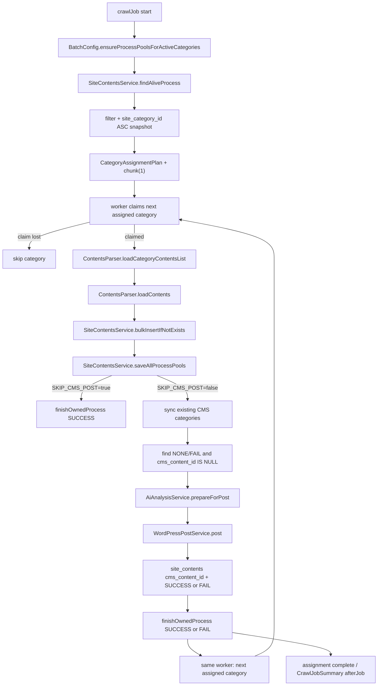
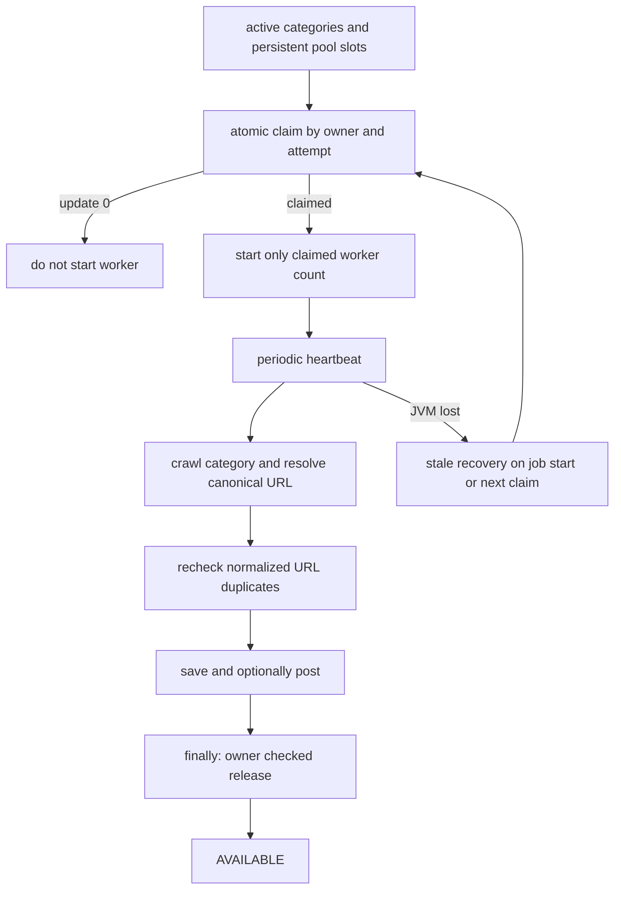

# web-crawler system understanding

## 1. 調査日時と対象

- 調査日時: 2026-08-04 JST
- リポジトリ基準: `origin/main` commit `0b5bc4fe9c21a5a0ef4b38ef85d58670326394f6`
- 作業ブランチ: `agent/reconstruct-web-crawler-specs`
- 作業モード: 文書変更。実装コード、本番DBマスタ、本番WordPress、GitHub Secretsは変更しない。
- DB操作: `SELECT` / `SHOW` のみ。接続文字列、ユーザー名、パスワードは出力していない。
- HTTP確認: Yahoo!ニュースと happinesea.com へ低頻度のGETのみ。クロールジョブ、WordPress投稿、AI API呼び出しは実行していない。
- 設計意図の確定: 2026-08-05のPR #34レビューで、`SiteInfoProcessPool` はカテゴリ単位の並列ワーカー管理プールであること、固定並列数を廃止すること、確実なreleaseとstale回収、canonical URL対応を次期要件とすることが確定した。
- 実装更新: 2026-08-21のcategory rotationでは、対象カテゴリをrun開始時に固定し、`CRAWL_PROCESS_LIMIT`をlogical worker上限として各workerが複数カテゴリを順次処理する。正本は[機能・マスタ仕様](web-crawler-master-data-spec.md)とする。

この文書では次を分ける。

- 確認済み事実: 2026-08-04時点の実DB、実装、HTTPレスポンスで確認した内容。
- コードからの推論: 実装の呼び出し関係から読み取れる意図。
- 未決定事項: 実装とマスタだけでは一意に決められない内容。
- 改善候補: 今回は変更しない次工程候補。

## 2. システムの目的

`web-crawler` は、外部情報源を `site_info` と `site_category` のマスタで管理し、カテゴリ単位で記事候補を取得し、記事詳細を内部共通形式の `site_contents` へ保存し、必要に応じてAIで投稿内容を加工し、WordPress REST APIへ投稿するSpring Boot / Spring Batchアプリケーションである。

WordPress投稿はCrawlerから独立したJob、サービス、サブシステムではなく、同じCrawler実行フロー内で `WordPressPostService` が担当する。`ArticleImagePolicy` は元記事の画像URL候補判定だけを担い、WordPress APIは扱わない。`featured_image_url` は元画像URLを保持し、WordPress公式media APIの返却IDは続くposts APIの `featured_media` にのみ使用する。独自のmedia ID管理DBは設けない。

```text
クロール -> SiteContents保存 -> 必要ならAI加工 -> WordPress media API登録 -> WordPress posts API投稿 -> cms_content_id / status更新
```

設計意図は次の通り。

- 外部情報源をサイト・カテゴリ単位でマスタ管理する。
- マスタ追加により収集先を拡張する。
- 外部記事をURL、title、description、contents、画像候補、公開元URLへ正規化する。
- `site_contents.url` の一意制約と保存前重複チェックでURL重複を防ぐ。
- カテゴリ単位のprocess poolを永続的なワーカー実行枠として使い、同一カテゴリの重複実行を防ぎながら再利用する。
- 外部HTTP、AI、WordPress投稿を長いDBトランザクションに含めない。
- `contract_type` により、原文全文を投稿するかdescription/title中心で投稿するかを切り替える。
- `cms_content_id` により元記事とWordPress投稿を結びつける。

現在の実装が満たしていない、または途中段階の意図もある。

| 意図 | 現在の実装 | 差分・リスク | 改善候補 |
| --- | --- | --- | --- |
| 完全な設定駆動HTMLクロール | DBセレクタに加えてYahoo固定フォールバックがある | DBマスタだけでは挙動を再現できない | サイト別adapterまたは明示的なfallback仕様化 |
| 複数取得方式の抽象化 | `HTML` と `Wordpress` のみ実装済み | `X` / `TIKTOK` / `YOUTUBE_SHORT` はEnumのみ | 未実装扱いを管理画面/文書に明記 |
| WordPress投稿の完全冪等性 | `cms_content_id IS NULL` とURL一意で制御 | WordPress側slug/meta/source URL照合は未実装 | source URL metaまたはslug方針を別PRで設計 |
| AIイベント集約 | 投稿直前のAI変換のみ | `site_contents_extra` / `site_contents_event` は実DBにもEntityにもない | 将来構想として分離 |
| process poolによる並列容量管理 | `CRAWL_PROCESS_LIMIT`以下の固定assignmentへ全対象poolを配分 | thread数と対象カテゴリ数を分離済み | 本番E2Eで1 workerの複数カテゴリ完走を確認 |
| leaseの確実な解放 | SUCCESS/FAIL更新で再claim可能だがownerをclearせず、heartbeatなし | 例外・JVM停止・長時間処理の所有権が不明確 | owner/attempt付きrelease、heartbeat、stale回収を導入 |
| canonical URLによる記事同一性 | 取得元URLをそのまま重複キーに使用 | redirect、canonical、tracking差で重複し得る | 信頼境界付きcanonical選択と詳細取得後の重複再照合 |

次期仕様の正本は[機能・マスタ仕様](web-crawler-master-data-spec.md#34-siteinfoprocesspoolの設計意図と次期実装要件)とし、この文書では現行実装との差分だけを要約する。

## 3. 現行処理シーケンス



主なクラス・メソッド:

| 段階 | 入力 | クラス・メソッド | 参照DB | 外部HTTP | 保存・更新 | 失敗時・再実行 |
| --- | --- | --- | --- | --- | --- | --- |
| Job定義 | Spring Batch起動 | `BatchConfig.crawlJob`, `crawlStep` | Batch metadata | なし | Job/Step実行履歴 | summaryで失敗件数があれば `FAILED` |
| pool補完 | 有効カテゴリ | `ensureProcessPoolsForActiveCategories` | `site_category`, `site_info_process_pool` | なし | 不足poolを `NONE` で保存 | 実DBのID非AUTO_INCREMENTと不整合リスク |
| 対象選択 | pool状態 | `SiteContentsService.findAliveProcess` | `site_info_process_pool` | なし | なし | `NONE`/`FAIL`/`SUCCESS`/timeout `PROCESSING` が候補 |
| 所有権取得 | pool id, owner | `claimSiteInfoProcess`, `claimForProcessing` | `site_info_process_pool` | なし | `PROCESSING`, `process_id`, `process_time` | 条件付きUPDATE 0件なら競合負け |
| 一覧取得 | `category_list_url` または `category_url` | `ContentsParser.loadCategoryContentsList` | `site_category`, `site_info` | GET | `SiteContents`候補生成 | 0件ならpool FAIL |
| 詳細取得 | 記事URL | `ContentsParser.loadContents` | `site_category` | GET | title/description/contents/featured image候補 | 記事単位でskip。全件失敗ならpool FAIL |
| DB保存 | 抽出済みcontents | `bulkInsertIfNotExists` | `site_contents` | なし | URL未登録分を保存 | URL一意制約が最終防衛 |
| 既存投稿カテゴリ同期 | カテゴリ | `syncExistingCmsCategories` | `site_contents` | WordPress REST | WordPressカテゴリ更新 | 失敗数があればpool FAIL |
| AI前処理 | 投稿対象 | `AiAnalysisService.prepareForPost` | なし | AI APIはmode有効時のみ | DB永続化なし。投稿用copy生成 | 設定不足・API失敗は原文fallback |
| WordPress投稿 | 投稿対象 | `WordPressPostService.post` | `site_category`, `site_info` | media/posts REST | `cms_content_id`, `process_status` | 対象contents FAIL、pool FAIL、次へ継続 |
| 完了更新 | pool owner | `finishOwnedProcess` | `site_info_process_pool` | なし | SUCCESS/FAIL | owner不一致なら上書きしない |

PR #34で次期要件だったowner/attempt、heartbeat、canonical URL、owner checked releaseは現在実装済みであり、固定category assignmentの各カテゴリ処理内で次のlease lifecycleを使う。



## 4. 実DBのマスタと状態

2026-08-04時点の実DBはMariaDB `10.0.19-MariaDB-log`。対象テーブルの件数は次の通り。

| テーブル | 実在 | 件数 | 備考 |
| --- | --- | ---: | --- |
| `site_info` | yes | 6 | 有効行はYahoo系2件、happinesea 1件、削除済みtest 3件 |
| `site_category` | yes | 10 | Yahoo 9件、happinesea 1件 |
| `site_info_process_pool` | yes | 10 | `PROCESSING` 9件、`FAIL` 1件 |
| `site_contents` | yes | 808 | `SUCCESS` 720件、`NONE` 88件 |
| `flyway_schema_history` | no | - | 本番DBではFlyway履歴なし |
| `site_contents_extra` | no | - | AI集約構想は未実装 |
| `site_contents_event` | no | - | AI集約構想は未実装 |

有効な `site_info`:

| id | site_name | site_url | contents_type | contract_type | delete_flg | 現行用途 |
| ---: | --- | --- | --- | --- | --- | --- |
| 1 | Yahoo!Japanニュース | `https://news.yahoo.co.jp/` | `1` HTML | `0` NONE | `0` | Yahooカテゴリ1-8と10の主設定 |
| 2 | happinesea hobby | `https://happinesea.com/` | `2` Wordpress | `0` NONE | `0` | happinesea REST取得 |
| 104 | Yahoo News | `https://news.yahoo.co.jp` | `1` HTML | `0` NONE | `0` | 有効だがカテゴリなし |

process pool:

| 状態 | 件数 | 現行意味 |
| --- | ---: | --- |
| `2` PROCESSING | 9 | すべて `process_id` NULL、2026-07-06から2026-07-19の古い `process_time` |
| `9` FAIL | 1 | happineseaカテゴリ。`process_id` NULL、2026-07-24 |

実DBと実装の主要差分:

| 項目 | 実装/マイグレーション | 実DB | 判定 |
| --- | --- | --- | --- |
| `flyway_schema_history` | Flyway migration V1-V6あり | テーブルなし | 本番schema authority不明 |
| `site_info_process_pool.site_info_process_id` | EntityはIDENTITY、V6はAUTO_INCREMENT | AUTO_INCREMENTなし | pool自動補完にリスク |
| `site_info_process_pool.process_id` | V6は `varchar(64)` | `varchar(20)` | owner `job-{id}` の将来長にリスク |
| `site_info_process_pool.site_category_id` | 一意制約は未導入 | 重複0、制約なし | データは整理済みだが保証なし |
| `site_category.contents_url_select_id` | Entity未使用 | 実DBに値あり | マスタとコード参照列がズレる |
| `site_contents.url` | unique前提 | uniqueあり、重複0 | 一致 |
| `site_contents.featured_image_url` | Entityあり | 列あり、値0件 | 画像方針は既存行に未反映 |

上表の実DB値は2026-07-31監査時点の履歴である。2026-08-13以降の実装は、通常HTMLでも代表画像metadataまたは本文中の有効画像を `featured_image_url` へ保存する。既存行のbackfillや本番DB更新はこの実装変更に含めない。

## 5. Yahoo!ニュース設定と現行ページ

Yahooカテゴリは `site_info_id=1` 配下に9件ある。id 2とid 10は同じ国内URLを指すため重複設定である。

| category id | name | 一覧URL | CMSカテゴリ | list selector | title selector | URL selector used by code | body selector |
| ---: | --- | --- | --- | --- | --- | --- | --- |
| 1 | 地域 | `https://news.yahoo.co.jp/topics/local` | 9 | `ul.newsFeed_list` | `.sc-jeCdPy` | `contents_url_selectId` は空。コードが `a[href*=/pickup/]` fallback | `.article_body` |
| 2 | 国内 | `https://news.yahoo.co.jp/topics/domestic` | 2 | `ul.newsFeed_list` | `.sc-jeCdPy` | 同上 | `.article_body` |
| 3 | 国際 | `https://news.yahoo.co.jp/topics/world` | 3 | `ul.newsFeed_list` | `.sc-jeCdPy` | 同上 | `.article_body` |
| 4 | 経済 | `https://news.yahoo.co.jp/topics/business` | 4 | `ul.newsFeed_list` | `.sc-jeCdPy` | 同上 | `.article_body` |
| 5 | エンタメ | `https://news.yahoo.co.jp/topics/entertainment` | 5 | `ul.newsFeed_list` | `.sc-jeCdPy` | 同上 | `.article_body` |
| 6 | スポーツ | `https://news.yahoo.co.jp/topics/sports` | 6 | `ul.newsFeed_list` | `.sc-jeCdPy` | 同上 | `.article_body` |
| 7 | IT | `https://news.yahoo.co.jp/topics/it` | 7 | `ul.newsFeed_list` | `.sc-jeCdPy` | 同上 | `.article_body` |
| 8 | 科学 | `https://news.yahoo.co.jp/topics/science` | 8 | `ul.newsFeed_list` | `.sc-jeCdPy` | 同上 | `.article_body` |
| 10 | Domestic | `https://news.yahoo.co.jp/topics/domestic` | 1 | `#uamods-topics > ul > li` | `li[data-ual-view-type="list"] ...` | `contents_url_selectId` は空。DBの `contents_url_select_id` は未使用 | `#uamods > div.article_body` |

低頻度HTTP確認結果:

| 対象 | 結果 |
| --- | --- |
| 一覧 `https://news.yahoo.co.jp/topics/domestic` | 200, `text/html;charset=UTF-8`, canonical同一, robots `noarchive, max-image-preview:large` |
| 一覧候補件数 | `ul.newsFeed_list`: 1, `#uamods-topics > ul > li`: 29, `li[data-ual-view-type=list]`: 25, `a[href*=/pickup/]`: 33 |
| 詳細例 `https://news.yahoo.co.jp/pickup/6590534` | 200, canonical同一, robots `noarchive, max-image-preview:large` |
| 詳細抽出 | `.article_body`: 0, `#uamods > div.article_body`: 0, `article p`: 14, `meta[name=description]`: 1, `article img[src]`: 3 |

現行仕様として言えること:

- 一覧URLは `site_category.category_list_url` 優先、空なら `category_url`。
- 一覧レコードはDBセレクタの後に `#uamods-topics > ul > li`、`li[data-ual-view-type=list]`、`.newsFeed_list > li`、`a[href*=/pickup/]` へfallbackする。
- URL抽出はEntityが参照する `contents_url_selectId` を使う。実DBの `contents_url_select_id` は使われない。
- `contents_url_selectId` が空の場合、`a[href*=/pickup/]` を使う。
- Jsoupの `abs:href` を使うため、相対URLはDocumentのbase URIから絶対URL化される。
- 詳細本文はDB `body_select_id` の後に `article p`、`article`、`main article p`、`main p` へfallbackする。
- descriptionは `meta[name=description]`、`og:description`、`twitter:description` から取得する。
- featured image候補は `image_src` / `itemprop=image`、`og:image` / `twitter:image`、記事型JSON-LD、選択本文内画像、article内画像の順に決定する。Yahooの本文画像がfallback本文selectorの外にあっても、代表画像metadataまたはarticle画像から取得する。
- 画像URLは相対URL、protocol-relative URL、lazy-load属性、`srcset` / `picture` を解決し、ロゴ、UI、広告、tracking、極小画像等を除外する。
- 「記事全文を読む」に一致するリンクがあれば、そのURLを取得して `more_body_select_id` で本文を取り直す。

Yahoo固有の未決定事項:

- pickupページにある配信元ページへ遷移して本文全文を取るか、Yahooページ上のdescription/本文断片に留めるかは契約・法務面の判断が文書化されていない。
- 動画、写真記事、有料記事、削除済み記事、JavaScript描画部分の扱いは個別仕様がない。
- `UrlCanonicalizer` がredirect/canonicalの信頼境界を評価し、tracking parameter、fragment、既定port、host大小、path表記を正規化する。requested/redirected/canonical/normalized/source URLとSHA-256をDBへ保持する。
- 広告・ランキング・関連記事除外はYahoo fallbackとタイトル妥当性チェックに依存しており、明示的な除外マスタはない。

## 6. happinesea.com設定と現行ページ

`site_info_id=2` は `contents_type=2` で、現在実装はWordPress REST APIを使う。

| category id | name | category_url/category_list_url | CMSカテゴリ | contents_type | 現行取得方式 |
| ---: | --- | --- | --- | --- | --- |
| 9 | ニュース・航航空知識 | `https://happinesea.com/category/news` | 8 | `2` Wordpress | `https://happinesea.com/wp-json/wp/v2/posts?per_page=20&_embed=1` |

低頻度HTTP確認結果:

| 対象 | 結果 |
| --- | --- |
| HTML一覧 | 200, `text/html; charset=UTF-8`, canonical同一, robots `index, follow, max-image-preview:large, max-snippet:-1, max-video-preview:-1` |
| HTML selector | `article`: 10, `.post`: 10, `.entry-title a`: 22, `ul.newsFeed_list`: 0 |
| REST API | `/wp-json/wp/v2/posts?per_page=3&_embed=1` が200、`application/json; charset=UTF-8` |
| pagination | `X-WP-Total=97`, `X-WP-TotalPages=33` |
| embedded media | `_embedded.wp:featuredmedia` あり、`featured_media` idあり |

現行仕様:

- `ContentsParser.isWordPressCategory` が `siteInfo.contentsType == Wordpress` を判定する。
- `category_list_url` が既に `/wp-json/wp/v2/posts` を含む場合はそのURLに `per_page=20` と `_embed=1` を補う。
- そうでなければ `site_info.site_url` または設定URLのoriginから `/wp-json/wp/v2/posts?per_page=20&_embed=1` を組み立てる。
- RESTレスポンスの `title.rendered`、`link`、`content.rendered`、`excerpt.rendered`、`_embedded.wp:featuredmedia[0].source_url` またはmedia APIの `source_url` を使う。
- REST取得時点で本文が入るため、`loadContents` は再度HTML詳細ページを取得せず、そのまま返す。
- WordPress RESTは `X-WP-TotalPages` と `web-crawler.wordpress-source.max-pages` を上限にpaginationする。`site_category.source_category_id` があれば `categories=` を付与する。

HTMLクロールとの比較:

| 方式 | 利点 | 欠点 | 現行適合 |
| --- | --- | --- | --- |
| HTMLクロール | 表示と同じ構造を確認できる | 現在のDBセレクタ `ul.newsFeed_list` 等では0件。テーマ変更に弱い | 不適合 |
| WordPress REST API | title/excerpt/content/featured media/date/category等が安定して取れる。paginationあり | RESTで公開される範囲に限定。HTML表示上の不要要素除去はcontent HTML依存 | 現行 `contents_type=2` と整合 |

マスタ修正候補:

- `category_list_url` をHTMLカテゴリURLではなく `/wp-json/wp/v2/posts?categories=<id>&per_page=20&_embed=1` へ寄せるかを判断する。
- 対象カテゴリ限定には `site_category.source_category_id` を設定する。既存の `category_list_url` に `categories=` がある場合も維持される。

## 7. 状態遷移と例外処理

`ProcessStatus`:

| 値 | Enum | 意味 |
| --- | --- | --- |
| `1` | `NONE` | 未処理 |
| `2` | `PROCESSING` | 処理中 |
| `0` | `SUCCESS` | 成功 |
| `9` | `FAIL` | 失敗 |

pool状態遷移:

以下は現行状態である。次期のpool状態は処理履歴ではなく `AVAILABLE -> PROCESSING -> AVAILABLE` とし、SUCCESS/FAILの処理結果をlease状態から分離する。owner、attempt、heartbeat、release、stale回収の確定要件は[機能・マスタ仕様 3.4](web-crawler-master-data-spec.md#34-siteinfoprocesspoolの設計意図と次期実装要件)を参照する。

| 初期状態 | イベント | 期待状態 | DB更新 | Job ExitStatus | 再実行 |
| --- | --- | --- | --- | --- | --- |
| `NONE` | claim成功 | `PROCESSING` | `process_id`, `process_time` 更新 | 継続 | 処理中は不可 |
| `FAIL` | claim成功 | `PROCESSING` | 同上 | 継続 | 可 |
| `SUCCESS` | claim成功 | `PROCESSING` | 同上 | 継続 | 現行互換で可 |
| timeout前 `PROCESSING` | 別実行が候補検索 | 変更なし | なし | 継続 | 不可 |
| timeout後 `PROCESSING` | claim成功 | `PROCESSING` | 新ownerへ更新 | 継続 | 可 |
| `PROCESSING` | クロール成功かつCMS成功/skip | `SUCCESS` | owner一致時のみ | 失敗件数なしならCOMPLETED | 可 |
| `PROCESSING` | クロール失敗またはCMS失敗 | `FAIL` | owner一致時のみ | 後続カテゴリ継続、最終Job `FAILED` | 可 |
| `PROCESSING` | owner不一致finish | 変更なし | 0更新 | 継続 | 新owner側に委譲 |

記事状態遷移:

| 初期状態 | イベント | 期待状態 | DB更新 | 再実行 |
| --- | --- | --- | --- | --- |
| 新規URL | DB保存 | `NONE` | `site_contents` insert | 投稿対象 |
| 既存URL | DB保存候補 | 変更なし | insertしない | 重複skip |
| `NONE`/`FAIL`, `cms_content_id IS NULL` | WordPress投稿成功 | `SUCCESS` | `cms_content_id`, title/content/description, status | 通常は再投稿対象外 |
| `NONE`/`FAIL`, `cms_content_id IS NULL` | WordPress投稿失敗 | `FAIL` | statusのみ | 次回再投稿対象 |
| `SUCCESS`, `cms_content_id IS NOT NULL` | カテゴリ同期成功 | `SUCCESS` | WordPress側カテゴリのみ | 再投稿なし |

## 8. 法務・運用境界

今回、利用規約・著作権判断は確定しない。ただし現行実装上の扱いは次の通り。

- 実DBのYahooとhappineseaはどちらも `contract_type=0`。
- `WordPressPostService.resolvePostBody` は `contract_type` が空または `0` の場合、投稿本文に `description` を優先し、なければ `title` を使う。
- `contract_type` が `1` 以上の場合だけ `contents` 本文を投稿候補にする。
- 投稿本文テンプレートは出典URLと出典サイト名を含める。
- 削除依頼、robots変化、リンク切れ、配信元への遷移可否は未決定事項であり、現行コードに停止条件はない。

## 9. テスト自動化準備状態

| 問い | 評価 | 根拠 |
| --- | --- | --- |
| 各機能の入力と出力が明確か | 一部不足 | 本文parser fallbackとYahoo配信元遷移が未決定 |
| DB状態遷移が一意に決まるか | 準備完了 | 現行は7章、次期leaseは機能・マスタ仕様3.4 |
| 例外時の期待結果が明確か | 一部不足 | HTTP retry後の0件扱いは明確、配信元本文不可時の業務判断は未決定 |
| Yahoo parser仕様が具体的か | 一部不足 | 現行fallbackは記載。広告/関連記事の厳密除外は不足 |
| happinesea parser仕様が具体的か | 準備完了 | REST取得方式、pagination不足、featured mediaを記載 |
| マスタ値と実装の対応が追跡可能か | 準備完了 | 5章、6章 |
| 外部サイトに依存せずCI可能か | 準備完了 | `docs/testing/web-crawler-test-spec.md` のfixture方針 |
| WordPress APIをmock可能か | 準備完了 | 既存 `WordPressPostServiceTest` がMockRestServiceServer使用 |
| AI APIをmock可能か | 準備完了 | 既存 `AiAnalysisServiceTest`, `OpenAiCompatibleAiClientTest` |
| MySQL固有テストを分離可能か | 準備完了 | `integrationTest` とGitHub ActionsのMariaDB 10.11で空DB/V6 upgrade、DDL、atomic claimを検証 |
| Codexが次回実装差分を生成できるか | 準備完了 | pool/canonicalの実装要件とテストIDを確定。DDL適用時期とYahoo外部canonicalは人間判断 |

## 10. P0/P1設定不備

P0:

- 実DBの `site_info_process_pool` schemaが最新実装/V6前提と不一致。`site_info_process_id` がAUTO_INCREMENTではなく、`process_id` が `varchar(20)`。
- 古い `PROCESSING` が9件残留している。timeout後回収対象だが、`process_id` NULLの旧状態なので原因調査が必要。
- leaseは `claimed_at` と `heartbeat_at` を分離し、owner/attempt一致のscheduler更新で生存確認する。stale回収とreleaseもowner/attemptでfencingする。
- `max-concurrency` とpool枠数が並列容量を二重管理している。次期実装で前者を段階廃止する。
- `site_contents` はrequested/redirected/canonical/normalized/source URLとnormalized hashを保持し、hash unique制約で競合insertを拒否する。

P1:

- Yahoo国内がid 2とid 10で重複している。
- `contents_url_select_id` に値が入っているがEntityは `contents_url_selectId` だけを読む。
- 旧Yahoo本文セレクタ `.article_body` は現行詳細ページで0件であり、fallback依存。
- happineseaはREST取得と整合するが、カテゴリURLからRESTカテゴリIDを限定していない。
- `featured_image_url` は全808件で空。

## 11. 今回変更しないもの

- `src/main/java/`
- `src/main/resources/db/migration/`
- `src/main/resources/application*.yml`
- 本番DBマスタ
- 本番WordPress
- GitHub Secrets
- 本番ジョブ設定
- Flyway実行、Spring Batch実行、WordPress投稿、AI API呼び出し
